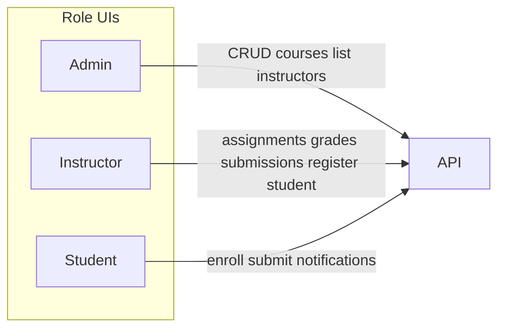

# Frontend Update: Backend Parity + Dark UI

## Context

- **Backend** (current workspace): ASP.NET Core API at [`Assignment -Management-System`](e:\Projects\Assignment-Management-System\Assignment -Management-System) — JWT auth, roles Admin / Instructor / Student, courses, assignments, submissions, grading, notifications, images.
- **Frontend** (sibling repo to update): Angular 21 + Bootstrap 5 at [`E:\Projects\Assignment-Management-System-Frontend\Assignment-Management-System-Frontend`](E:\Projects\Assignment-Management-System-Frontend\Assignment-Management-System-Frontend).
- CORS expects `http://localhost:4200`. Align API base URL with backend `launchSettings` (today frontend hardcodes `https://localhost:44308/api`; backend default is `http://localhost:5296`).

---

## Phase 0 — Foundation fixes (blockers)

Do these first so all later features work.

| Issue | Fix |
|-------|-----|
| Env key mismatch (`BaseUrl` vs `baseurl`) + always importing `environment.development` | Unify to `baseUrl` in both env files; import `environment` only; set `baseUrl` to match running API (e.g. `http://localhost:5296/api`) |
| `/` → 404 | Add redirect `{ path: '', redirectTo: 'Home', pathMatch: 'full' }` in [`app.routes.ts`](E:\Projects\Assignment-Management-System-Frontend\Assignment-Management-System-Frontend\src\app\app.routes.ts) |
| Bootstrap JS missing | Add `bootstrap` bundle in `angular.json` scripts (navbar collapse) |
| JSON casing | Confirm API camelCase (or add interceptor); align models with `ResponseModel` / `AuthModel` |
| Logout | Clear storage, navigate to `/Login`, refresh navbar state |
| Post-login redirect | Role-aware: Admin → `/Courses`, Instructor → `/Courses`, Student → `/Courses` (or enrollments) |

---

## Phase 1 — Complete / fix API services

Update services under `src/app/Services/`. Keep the backend typo route **`/Submisision`**.

### Auth ([`auth-service.ts`](E:\Projects\Assignment-Management-System-Frontend\Assignment-Management-System-Frontend\src\app\Services\auth-service.ts))
- Keep Login + RegisterUser
- Add `registerStudent(user)` → `POST /Auth/RegisterStudent`

### Course ([`course-service.ts`](E:\Projects\Assignment-Management-System-Frontend\Assignment-Management-System-Frontend\src\app\Services\course-service.ts))
- Fix create: send `FormData` (`CrsName`, `InstId`, `Image`) not JSON
- Add `getCourseImage(id)` → blob from `GET /Course/Image/{id}` (or use `imageUrl` from DTO when present)
- Ensure delete/update refresh callers

### Assignment ([`assignment-service.ts`](E:\Projects\Assignment-Management-System-Frontend\Assignment-Management-System-Frontend\src\app\Services\assignment-service.ts))
- Fix `updateAssignment` → `PUT /Assignment/{id}` with JSON `{ title, deadLine }` (no file replace — matches backend)
- Implement `deleteAssignment` → `DELETE /Assignment/{id}`
- Keep create via `POST /Instructor` FormData; keep file download via `GET /Instructor/file/{id}`

### Submission ([`submisiion-service.ts`](E:\Projects\Assignment-Management-System-Frontend\Assignment-Management-System-Frontend\src\app\Services\submisiion-service.ts))
- Replace mocks with:
  - `POST /Submisision` FormData (student submit)
  - `GET /Submisision/{assignid}` (instructor list)
  - `GET /Submisision/file/{submissionId}` (download)

### Instructor ([`instructor-service.ts`](E:\Projects\Assignment-Management-System-Frontend\Assignment-Management-System-Frontend\src\app\Services\instructor-service.ts))
- Add `setGrade(subId, grade)` → `PUT /Instructor?Subid=&grade=`
- Add `getAssignmentGrades(assignmentId)` → `GET /Instructor/{assignmentid}`
- Add profile image upload/get

### Student ([`student-service.ts`](E:\Projects\Assignment-Management-System-Frontend\Assignment-Management-System-Frontend\src\app\Services\student-service.ts))
- Keep enrollments `GET /Student`
- Add `getSubmitDetails(assignId)` → `GET /Student/SubmitDetails?assignid=`
- Replace mock search with `GET /Student/{name}`
- Add profile image upload/get

### Notification ([`notification-service.ts`](E:\Projects\Assignment-Management-System-Frontend\Assignment-Management-System-Frontend\src\app\Services\notification-service.ts))
- Replace mocks: `GET /Notification`, `PUT /Notification/MarkasRead/{id}`
- Show only for **Student** in navbar

### Remove / ignore
- [`category-service.ts`](E:\Projects\Assignment-Management-System-Frontend\Assignment-Management-System-Frontend\src\app\Services\category-service.ts) — no backend Category API; remove usages from edit-course leftovers

---

## Phase 2 — Fix existing broken pages

| Page | Fixes |
|------|--------|
| [`add-course`](E:\Projects\Assignment-Management-System-Frontend\Assignment-Management-System-Frontend\src\app\Components\add-course) | Attach selected image to FormData; load instructors for `InstId` select |
| [`edit-course`](E:\Projects\Assignment-Management-System-Frontend\Assignment-Management-System-Frontend\src\app\Components\edit-course) | Clean unused Category imports; show success/errors; instructor dropdown |
| [`courses`](E:\Projects\Assignment-Management-System-Frontend\Assignment-Management-System-Frontend\src\app\Components\courses) | Refresh list after delete; show real course images |
| [`edit-assignment`](E:\Projects\Assignment-Management-System-Frontend\Assignment-Management-System-Frontend\src\app\Components\edit-assignment) | Read `assignmentId` (not `id`); call fixed PUT; remove file field if backend ignores it |
| [`assignment-details`](E:\Projects\Assignment-Management-System-Frontend\Assignment-Management-System-Frontend\src\app\Components\assignment-details) | Wire delete; student “my submission / grade” via SubmitDetails; instructor link into submissions/grades |
| [`submit-assignment`](E:\Projects\Assignment-Management-System-Frontend\Assignment-Management-System-Frontend\src\app\Components\submit-assignment) | Bind file + call submit API; handle deadline / already-submitted errors |
| [`navbar`](E:\Projects\Assignment-Management-System-Frontend\Assignment-Management-System-Frontend\src\app\Components\navbar) | Real student notifications + mark read; role-correct links; working logout |

---

## Phase 3 — New / complete feature UIs (backend coverage)

### Instructor
1. **Register Student** — new page or modal (e.g. `/Students/Register`) → `RegisterStudent`
2. **Submissions** ([`submissions`](E:\Projects\Assignment-Management-System-Frontend\Assignment-Management-System-Frontend\src\app\Components\submissions)) — require `assignmentId` query/route; list API submissions; download file; grade input (0–10) calling `setGrade`; optional grades summary from `getAssignmentGrades`
3. **Students** ([`studentspage`](E:\Projects\Assignment-Management-System-Frontend\Assignment-Management-System-Frontend\src\app\Components\studentspage) / [`student-details`](E:\Projects\Assignment-Management-System-Frontend\Assignment-Management-System-Frontend\src\app\Components\student-details)) — search by name via API; details from search result (backend has no get-by-id beyond name lookup)

### Student
4. Enroll + my courses (already partial) — polish + images
5. Submit + view own submission/grade on assignment details
6. Notifications dropdown (unread only + mark read)

### Shared / profiles
7. **Profile** page (Student + Instructor) — upload/display profile image via existing endpoints
8. Course cards use `GET /Course/Image/{id}` blob URLs (revoke on destroy)

### Admin
9. Course CRUD + instructor picker only (backend `AdminController` is empty — no extra admin module)

### Routing additions
- `''` → `Home`
- Instructor: register-student route
- Submissions: `/Submissions/:assignmentId` (or query) so list is assignment-scoped
- Optional `/Profile` for authenticated users

---

## Phase 4 — Dark theme (black / gray) + UI polish

Keep Bootstrap; override globally — no new UI library.

1. **[`styles.css`](E:\Projects\Assignment-Management-System-Frontend\Assignment-Management-System-Frontend\src\styles.css)** — CSS variables:
   - `--bg: #0a0a0a`, `--surface: #141414`, `--surface-2: #1e1e1e`, `--border: #2a2a2a`, `--text: #e8e8e8`, `--muted: #9a9a9a`, `--accent: #6b7280` (gray, not purple/blue-heavy)
2. **Body / shell** — dark background; [`navbar`](E:\Projects\Assignment-Management-System-Frontend\Assignment-Management-System-Frontend\src\app\Components\navbar) `navbar-dark`; [`footer`](E:\Projects\Assignment-Management-System-Frontend\Assignment-Management-System-Frontend\src\app\Components\footer) dark gray
3. **Forms / cards / tables / buttons** — dark inputs, borders, muted primary buttons in gray scale; replace stock MDBootstrap “FAKE” images with course/profile blobs or subtle gray placeholders
4. **Per-page CSS** — fill currently empty component styles for spacing, tables, empty states, toast/alert styling
5. **Home** — dark branded first viewport (product name hero, one CTA to Login/Courses); remove generic template clutter
6. **Motion** — 2–3 subtle transitions (nav link hover, card fade-in, button press) — not glow/purple effects
7. **Responsive** — verify mobile navbar + forms

---

## Phase 5 — Cleanup and verification

- Remove dead imports (`Home` in `app.ts`, unused `withFetch`, Category leftovers)
- Consistent error display from `ResponseModel.message` / `AuthModel.message`
- File size/type hints matching backend (assignments/submissions ≤10 MB; images ≤5 MB; allowed extensions)
- Manual smoke test per role against running API + Swagger

---

## Implementation order (execution)

1. Env + routes + theme tokens (foundation + dark base)
2. Service layer (all endpoints)
3. Fix broken existing pages
4. Submissions / grading / register student / notifications / profile
5. Full UI pass on remaining pages
6. Role smoke test + polish

## Out of scope (backend gaps — do not invent)

- Password reset, refresh tokens, email verify
- Admin-only controller endpoints (none exist)
- Resubmit after deadline / replace assignment file on edit
- Category feature
